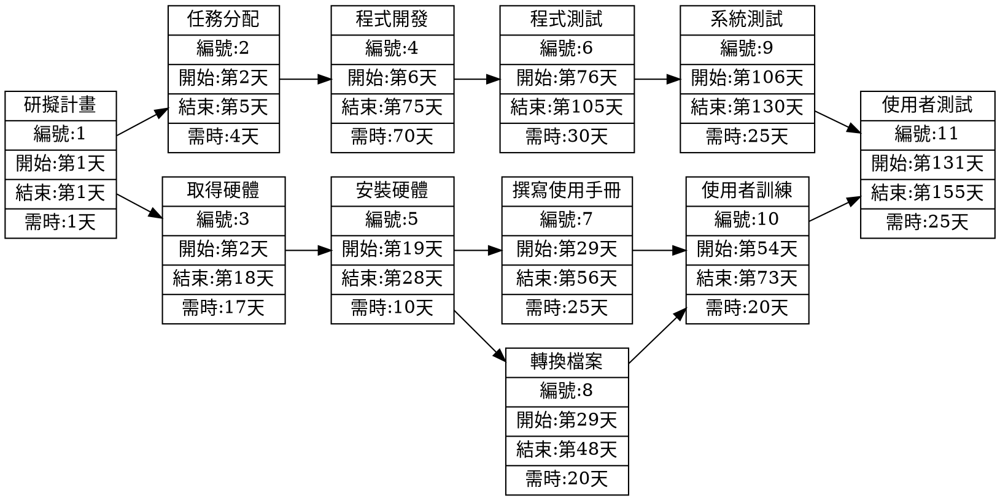
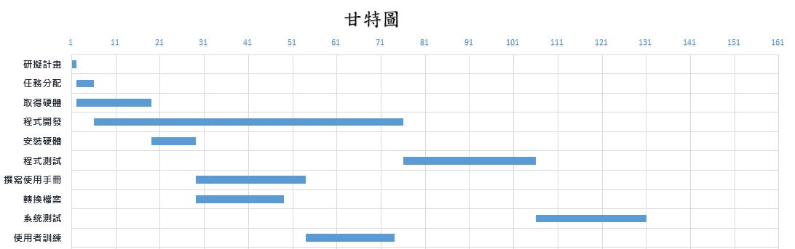

## Homework2_20221003

```graphviz
digraph {
  node[shape=record]
  rankdir="LR"
  no1 [label = "研擬計畫 | 編號:1 | 開始:第1天 | 結束:第1天 | 需時:1天"]
  no2 [label = "任務分配 | 編號:2 | 開始:第2天 | 結束:第5天 | 需時:4天"]
  no3 [label = "取得硬體 | 編號:3 | 開始:第2天 | 結束:第18天 | 需時:17天"]
  {rank=same;no2 no3}
  no1->no2
  no1->no3
  no4 [label = "程式開發 | 編號:4 | 開始:第6天 | 結束:第75天 | 需時:70天"]
  no2->no4
  no5 [label = "安裝硬體 | 編號:5 | 開始:第19天 | 結束:第28天 | 需時:10天"]
  no3->no5
  no6 [label = "程式測試 | 編號:6 | 開始:第76天 | 結束:第105天 | 需時:30天"]
  no4->no6
  no7 [label = "撰寫使用手冊 | 編號:7 | 開始:第29天 | 結束:第56天 | 需時:25天"]
  no8 [label = "轉換檔案 | 編號:8 | 開始:第29天 | 結束:第48天 | 需時:20天"]
  {rank=same;no7 no8}
  no5->no7
  no5->no8
  no9 [label = "系統測試 | 編號:9 | 開始:第106天 | 結束:第130天 | 需時:25天"]
  no6->no9
  no10 [label = "使用者訓練 | 編號:10 | 開始:第54天 | 結束:第73天 | 需時:20天"]
  no7->no10
  no8->no10
  no11 [label = "使用者測試 | 編號:11 | 開始:第131天 | 結束:第155天 | 需時:25天"]
  no9->no11
  no10->no11
}
```
---
### 關鍵途徑1->2->4->6->9->11
---

